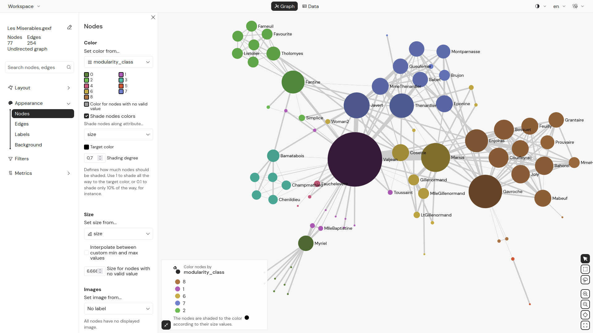
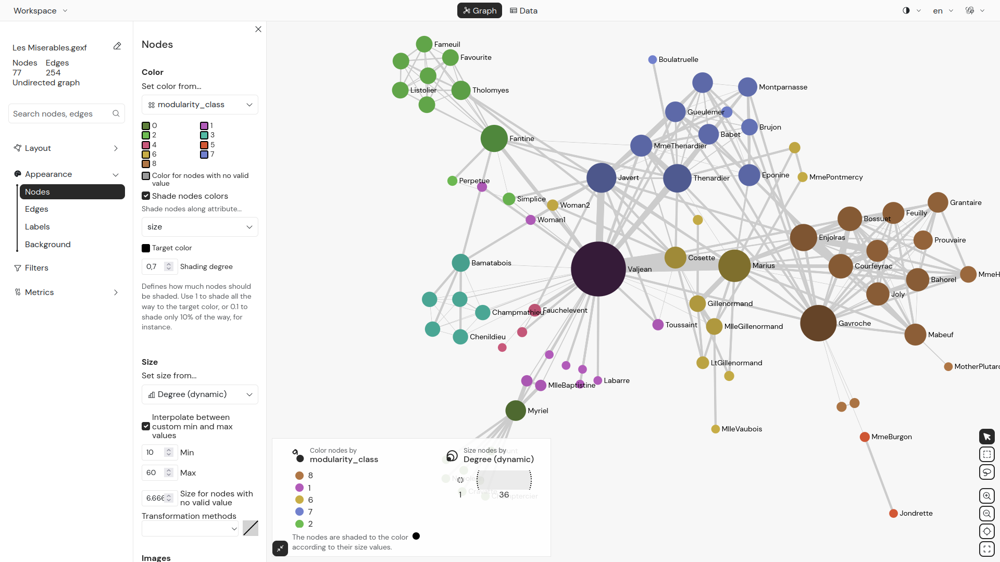

<section>

## Open Gephi Lite

> Open Gephi Lite by visiting the address https://gephi.org/gephi-lite/ in your browser (preferably Firefox or Chrome)

</section>

<section>

## Import a dataset

</section>

<section>

### “Welcome”

A ‘Welcome’ window will appear, prompting you to create a new project.

In Gephi Lite you can open

- Local graph files that are stored on your computer.
- Graph files stored in your GitHub account.

Creating a network based on your own data depends on your project, discipline, data source, etc.

- An Excel or CSV file with two columns “Source” and “Target” (indicating the origin and end of the connection) is sufficient to produce a network in Gephi.
- If your data table is encoded differently, you can use [Table2Net](https://medialab.github.io/table2net/) to convert it into a Gephi network.
- Other data analysis and web analytics software can also be used to produce files (Gexf or GraphML) compatible with Gephi Lite.

> For this tutorial, select the first sample dataset, “Les_Miserables.gexf”, which contains a very simple network of characters from Victor Hugo's novel.

</section>

<section>

### “Data laboratory”

Now that the GEXF has been imported, a network appears in the centre of the “Graph” window.

> Before working on it, however, click on “Data” at the top of the Gephi Lite interface to open the data table window.

The “Data” window allows you to view, and if necessary edit, your data in tabular format.

At the top left of this window, the “Nodes” and “Edges” buttons allow you to navigate between the two tables.

In both of them you can

- sort the nodes and edges of your network, clicking on the headings of the table
- search nodes and edges using the field on the top right

Using the menu on the left, you can also

- create new nodes, edges or columns
- filters the tables
- calculate metrics

> Click on the “Graph” tab at the very top of the interface, to go back to the main exploration window of Gephi Lite.

</section>

<section>

## Interacting with the network

</section>

<section>

### “Graph”

The “Graph” window is the heart of Gephi Lite. It displays your networks according to the parameters you set in the menu on the left.

Since most networks are too complex for each of their elements to be readable at the same time, the “Graph” window allows you to

- zoom: by using the scrolling gesture you use on your computer on the network
- pane: by left-clicking and dragging on the background of the graph
- move nodes around: by left-clicking and dragging them

On the bottom right of the graph, buttons allows you to switch between a series of tools to

- select nodes individually or through a rectangle or a lasso
- to zoom in an out and to recenter your network

</section>

<section>

## Changing the objects size and colors

</section>

<section>

### “Appearance”

In the “Appearance” menu on the left side of the graph window, you can change the colour and size of nodes, edges and of their label based on pre-existing attributes or metrics calculated by Gephi.

</section>

<section>

### “Nodes Appearance”

By default in this sample GEXF dataset, nodes are coloured according to their “Modularity class”, a category obtained by a community detection calculation. You can change this choice or the palette of color used to represent it.

> Click on "Appearance", then “Nodes”.
> In the “Set color from...” drop-down menu select “modularity_class”.

> Check the “Shade nodes colors”.
> Select “Size” from the drop-down menu.
> Chose black from the “Target color” color picker.
> Set the “Shading degree” to 0,7.

> Now unfold the “Size” drop-down menu
> Choose the “Degree (dynamic)” option to change the size of your nodes proportionally to the number of their connections
> Enter minimum and maximum values (e.g. 10 and 60) to resize the nodes
> Notice that a legend for size and color is automatically generated and updated at the bottom of your graph

</section>

<section>

### “Labels Appearance”

Under "Appearance”, in the submenu “Labels”, you can change the size and density of the labels of you graph.

> Unfold the drop-down menu under “Set label sizes from...” and chose “Nodes size”
> Set the label size to “20”
> Move the slider under “How many labels should appear any time” to hide the smaller labels

</section>

<section>

## Playing with the layout

</section>

<section>

### ForceAtlas2

In the “Layout” menu, you can modify the spatialisation of the graph by choosing one of the algorithms offered.

> Unfold the “Layout” menu.
> Select “ForceAtlas 2” — the force-directed algorithm especially developed for Gephi.
> Click the button “Start” at the bottom of the menu to launch the algorithm and see the nodes repulse each other and the edges binding the nodes that they connects.
> When the algorithm has reached a stable balance between the two forces and you are satisfied with the result, click “Stop” to halt the spatialization process.

You will find that you need to play around with the settings to obtain a readable network:

> Check the “Adjust size?” check-box.
> Change the “Scaling ratio” to 30 to give the graph more space.
> Click “Start” again to launch the algorithm with the new settings.

</section>

<section>

## Graph metrics

</section>

<section>

### “Metrics”

The “Metrics” menu on the left side of the screen allows you to calculate certain properties of the graph. For example, it includes centrality metrics and calculations that provide information about the overall structure of the network, its clusters, and communities.

</section>

<section>

### “Betweeness centrality”

> To calculate betweenness centrality, select it under the “Metric” menu and click on “Compute metric” at the very bottom of the menu.
> The values for this metric are now recorded in the Nodes table of the “Data” table in fresh new columns.

</section>

<section>

### “Appearance” to apply the new metric to the nodes

You can now return to the “Appearance” window to change the colour of the nodes based on the betweenness centrality you just calculated.

> Select “Nodes” under “ then the “Appearance”.
> In the “Set color from...” drop-down menu select “betweennessCentrality”.
> You can then choose the colour gradient by clicking directly on the coloured bar and change the colours manually.

</section>

<section>

## Filtering the graph

</section>

<section>

### “Filters”

The “Filters” menu allows you to filter your graph in multiple ways based on attributes or properties of nodes or edges, as well as based on the overall topology of the network.

> open the filter panel by clicking on “Filters” in menu
> Click on “Add Filter” button.
> In the modal section entitled “Nodes attributes” click on “Degree (dynamic)”.
> Gephi Lite will automatically generate an histogram of the distribution of the degree in your network
> Increase the “Min” value to 2, to hide all the nodes with less than 2 connections.
> The small histogram now shows that you are no longer viewing the entire network.

</section>

<section>

## “Export” the graph file and picture

To export your network file:

> Open the “Workspace” menu at the top left of Gephi Lite's interface.
> Select “Export graph file” to download your network in .gexf format.

To export the network picture:

> Select “Export image” to download a .png snapshot of your network as you visualized it

</section>

<section>

## Saving the Gephi Lite project

Exporting the graph file or a picture is not the (only) output of your work. Before leaving, don't forget to save your Gephi Lite project itself.

> Open the “Workspace” menu
> Click on “Save as…”
> Choose if you want to download the project on your computer as a .json or save it to your GitHub account.

You can then reopen it later with all your changes intact!

</section>
