<section>

## Install Gephi

> Go to gephi.org to download the latest version of Gephi (Desktop application).

- On Windows, after the download completes, run the installer and follow the steps.
- On Mac OS X, click on the .dmg file and drag the Gephi app to the Applications folder.
</section>

<section class="common-title">

## Import a dataset

</section>

<section>

### “Welcome”

Open Gephi. A ‘Welcome’ window will appear, prompting you to create a new project.

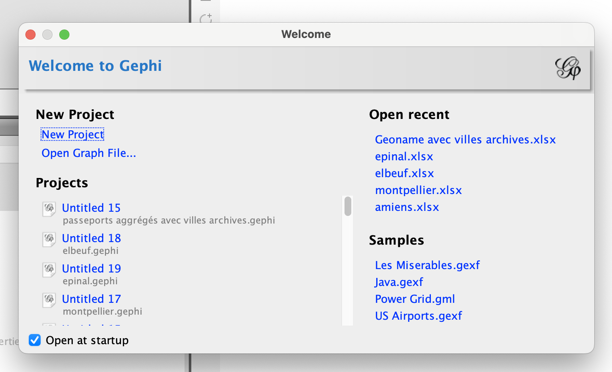

Creating a network based on your own data depends on your project, discipline, data source, etc.

- An Excel or CSV file with two columns “Source” and “Target” (indicating the origin and end of the connection) is sufficient to produce a network in Gephi.
- If your data table is encoded differently, you can use Table2Net to convert it into a Gephi network.
- Other data analysis and web analytics software can also be used to produce files compatible with Gephi.

> For this tutorial, select the first sample dataset, “Les_Miserables.gexf”, which contains a very simple network of characters from Victor Hugo's novel.

### “Import report”

On opening a network file, the “Import report” window allows you to check that the software has read the network correctly and that there were no errors during import.

- The import report will tell you how many nodes and edges are present in your network
- and will allow you to choose whether you want to import the network in a new workspace or append/merge it with an network you have already opened

> Click OK.

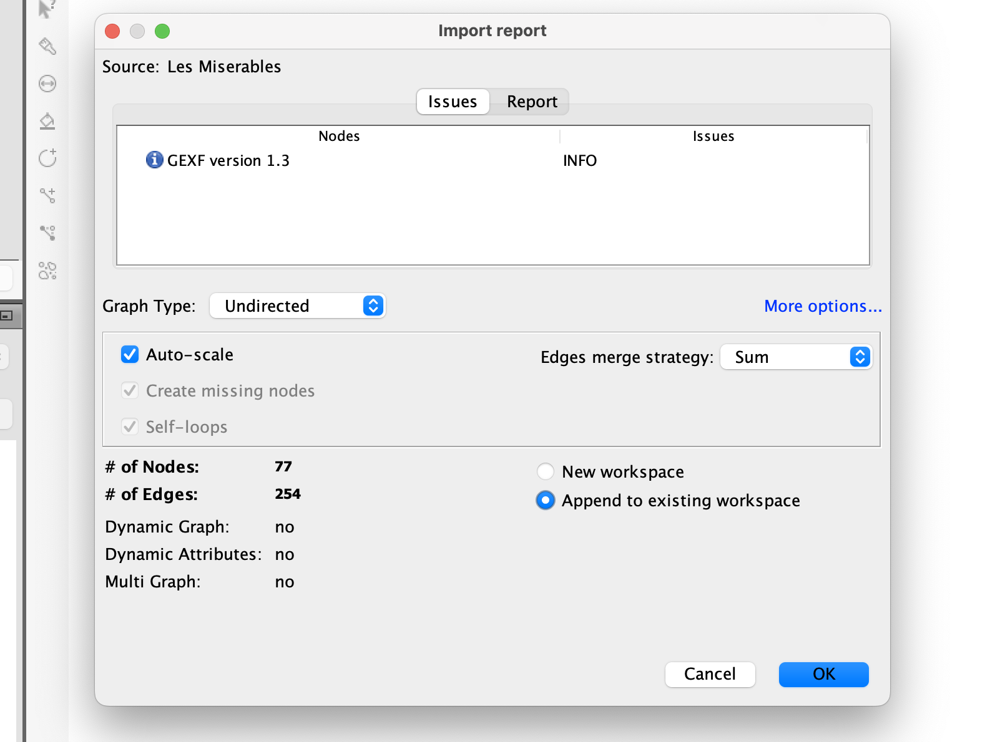

</section>

<section class="common-title">

### “Data laboratory”

</section>
<section>

Now that the GEXF has been imported, a network appears in the centre of the “Overview” tab.

> Before working on it, however, click on the “Data Laboratory” tab at the very top of the Gephi interface.

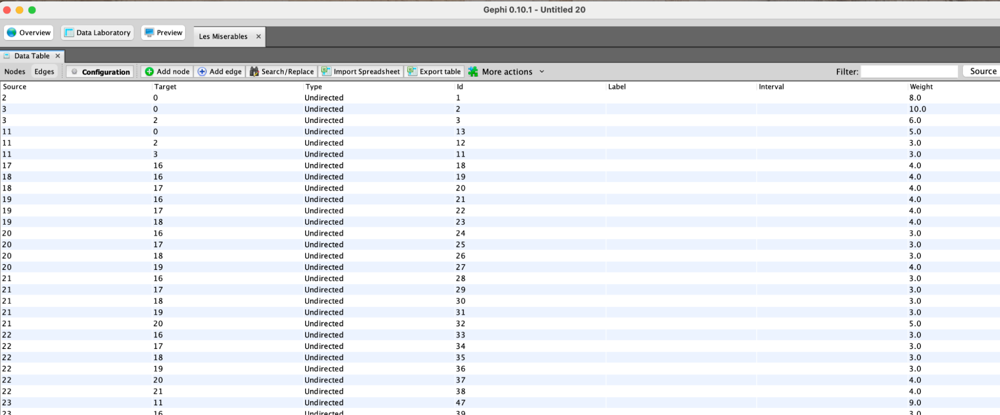

The Data Laboratory allows you to view, and if necessary edit, your data in tabular format.

At the top left of the “Data Table” window, the “Nodes” and “Edges” buttons allow you to navigate between the two tables.

In both of them you can

- sort the nodes and edges of your network, clicking on the headings of the table
- filter the table, using the field on the top right
- operate on the columns, using the button under the table

> Click on the “Overview” tab at the very top of the interface, to go back to the main exploration tab of Gephi.

</section>

<section class="common-title">

## Interacting with the network

</section>

<section>

### “Graph”

The “Graph” window at the center of the “Overview” tab is the heart of Gephi. It displays your networks according to the parameters you set in the other windows.

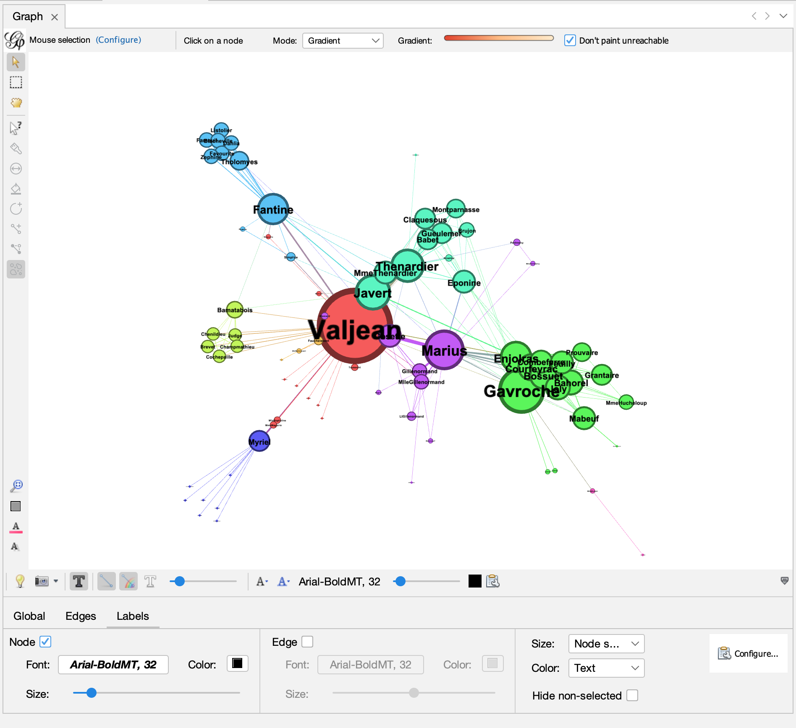

### “Top left menu” : interaction with the network

Since most networks are too complex for each of their elements to be readable at the same time, the “graph” window allows you to

- zoom: by using the scrolling gesture you use on your computer on the network
- pane: by right-clicking and dragging the network

On the left of the “graph” window, buttons allows you to switch between a series of tools to

- select on or more nodes
- drag and move node in the same of the network
- color individual nodes, etc.

### “Bottom menu” : rendering

A bit hidden at the bottom of the “graph” window, you find a folding menu that can be unfolded by clicking on the small arrow on the right.

> Click on the small arrow on the bottom-right of the “graph” window to unfold the menu.

Once unfolded the menu will allow you to control the rendering of the “graph” window and modify

- global parameters such as the color of the background
- the scale of the thickness of the edges
- and, most importantly to control the visualization of the labels (showing and hiding them, changing their size, and making it proportional to the size of the nodes)

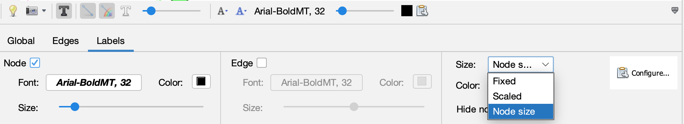

> - Click on the checkbox to display the nodes’ label
> - Set the size to “node size”
> - and use the “size” slider to set the final size of labels.

</section>

<section class="common-title">

## Changing the objects size and colors

</section>

<section>

### “Appearance”

In the “Appearance” window, you can change the colour and size of nodes and edges based on pre-existing attributes or metrics calculated by Gephi.

> - Click on “Nodes” then on the “Size” icon (the circles of different sizes),
> - Select “Ranking”,
> - Choose the “Degree” attribute
> - Enter minimum and maximum values (e.g. 10 and 50) to resize the nodes
> - Click on “Apply”.

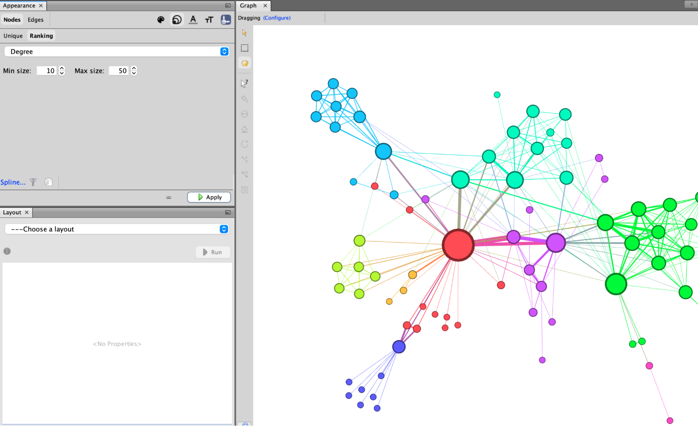

You can also change the colour of the nodes (by clicking on the colour palette icon) or modify the display of the edges. By default in this sample GEXF dataset, nodes are coloured according to their ‘Modularity class’, a category obtained by a community detection calculation.

</section>

<section class="common-title">

## Playing with the layout

</section>
<section>

### ForceAtlas2

In the ‘Layout’ window, you can modify the spatialisation of the graph by choosing one of the algorithms offered.

> - Select “ForceAtlas 2” — the force-directed algorithm especially developed for Gephi.
> - Click the button “Run” to launch the algorithm and see the nodes repulse each other and the edges binding the nodes that they connects.
> - When the algorithm has reached a stable balance between the two forces and you are satisfied with the result, click “stop” to halt the spatialization process.

You will find that you need to play around with the settings to obtain a readable network:

> - Change the ‘Scaling’ to 100 to give the graph more space
> - Select ‘Prevent Overlap’ so that the nodes do not cover each other.
> - Click “Run” again to launch the algorithm with the new settings.

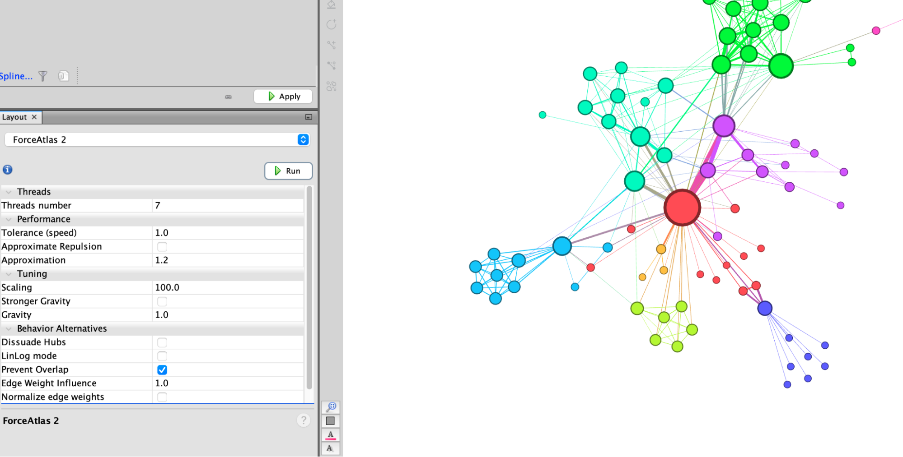

</section>

<section class="common-title">

## Graph metrics

</section>
<section>

### “Statistics”

On the right side of the screen, the ‘Statistics’ window allows you to calculate certain properties of the graph. For example, it includes centrality metrics and calculations that provide information about the overall structure of the network, its clusters, and communities.

### “Network Diameter”

> - To calculate betweenness centrality, click on “Run” next to “Network Diameter”.
> - This opens a small pop-up window in which you can specify whether the graph is directed or not (in this case, it is not).
> - Click OK to close it and start the calculation.

This generates a small statistical report that provides information on the distribution of the three measurements taken. These values are now recorded in the Nodes table of the ‘Data Laboratory’ in fresh new columns.

> You can exit the small report by clicking on ‘Close’.

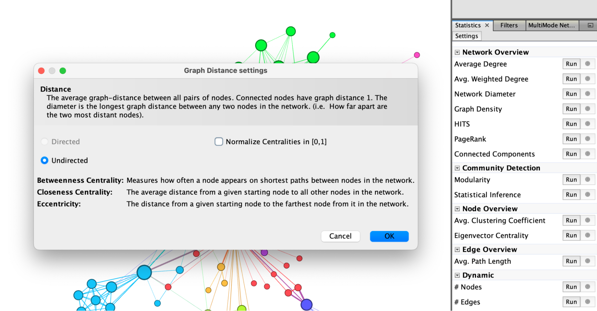

</section>

<section>

### “Appearance” to apply the new metric to the nodes

You can now return to the ‘Appearance’ window to change the colour of the nodes based on the Betweenness centrality you just calculated.

> - Select “Nodes”, then the “Colour” icon (the colour palette) and the “Ranking” tab to choose ‘Betweenness Centrality’ from the drop-down menu.
> - You can then choose the colour gradient by clicking directly on the coloured bar and change the colours manually or by clicking on the small coloured menu on the right to choose one of the default palettes.

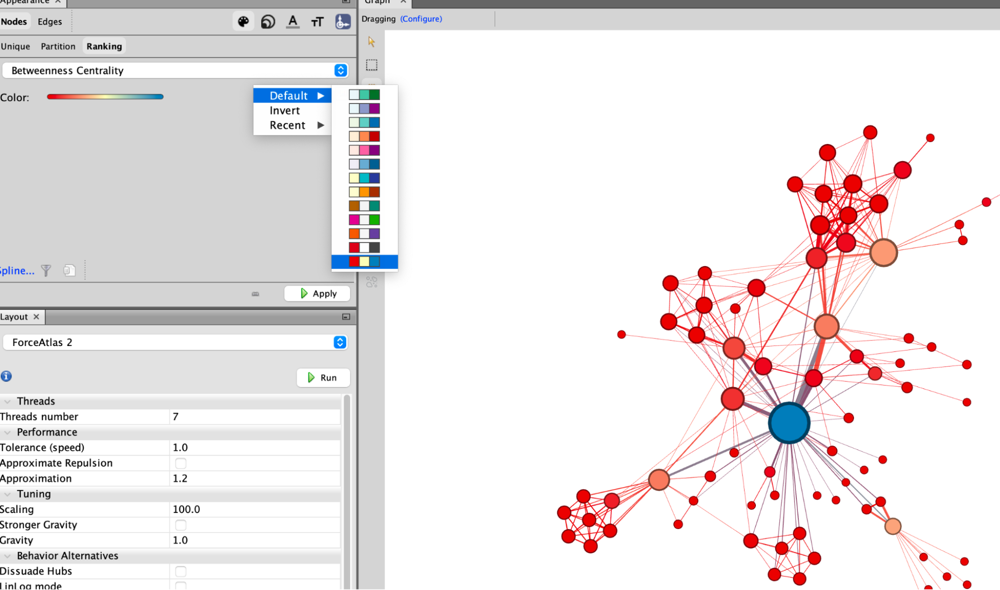

</section>

<section class="common-title">

## Filtering the graph

</section>
<section>

### “Filters”

The “Filters” window allows you to filter your graph in multiple ways based on attributes or properties of nodes and edges.
Filters are organised in folders and sub-folders. Under the folder “Attributes”, for example, you will find all the filters operating on the variables saved in the columns of your Data Laboratory. Under the folder “Topology”, you will find all the filters related to the relational structure of the network.

> - Double-click on “Topology” and then “Degree Rank” to filter nodes based on the number of their connections
> - Move the “Degree Range Settings” left slider at the bottom to 2, click on the “Filter”’ button to hide all the nodes with less than 2 connections

The small ‘Context’ window at the top right indicates that you are no longer viewing the entire network, but only three quarters of the nodes.

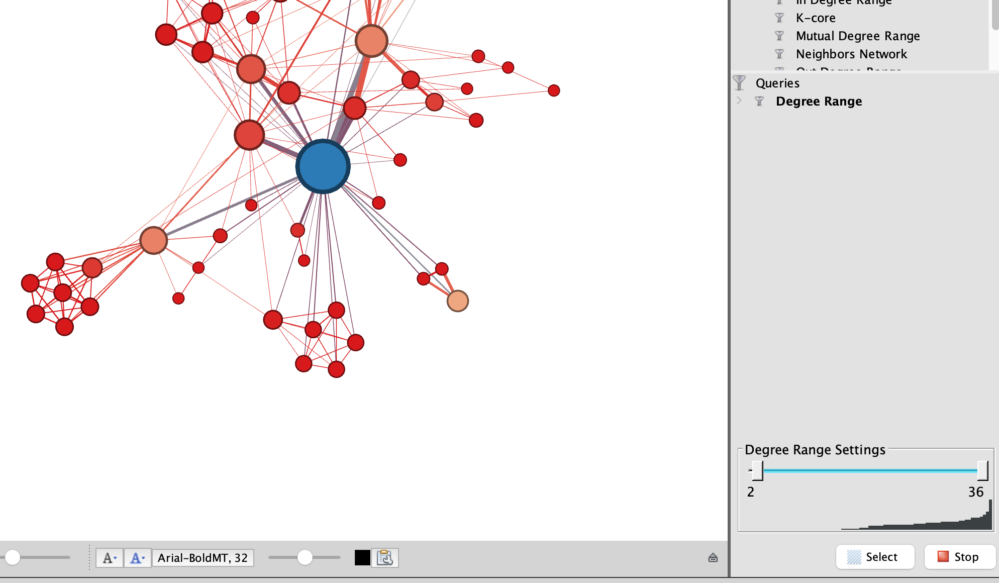

</section>
<section>

## “Preview” - create a nice final picture

Once your exploration is complete, you can move on to the careful production of a nice static image.

> To do so go to the ‘Preview’ tab.

On the left, in the ‘Preview Settings’ window, you will find a whole range of settings related to graphic rendering. Any changes you make here will not alter the graph itself, but only its final visual appearance.

> - For example, select ‘Show Labels’ to display the names of the characters in Les Misérables, but deselect ‘Proportional size’ so that they are all the same size.
> - Change the ‘Opacity’ of the edges to 60, so that they are easy to follow when they intersect and overlap, and deselect ‘Curved’ to get straight lines.
> - Click ‘Refresh’ to apply these changes.

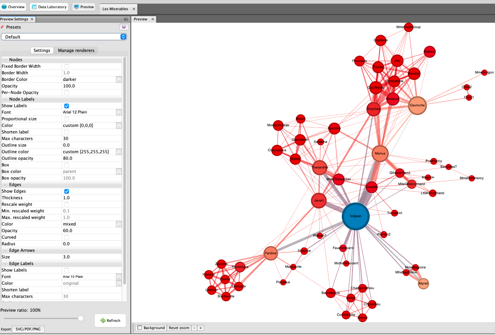

## “Export” - Picture export

> To export the image, click on ‘Export: SVG/PDF/PNG’.

An SVG vector file can be easily edited with software such as Inkscape, but if you just need a simple image, a PNG file will suffice.

> In this case, in the export pop-up window, you can click on ‘Options’ to increase the size of the image and thus ensure that your image will not be too pixelated.

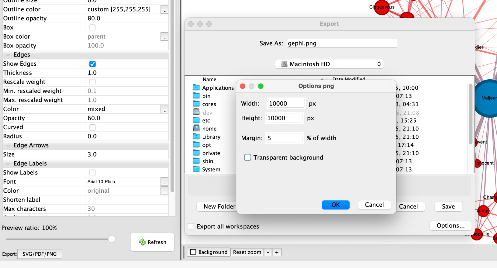

</section>

<section>

## Saving the Gephi project

But a static image is not the (only) output of your work. Before leaving, don't forget to save your Gephi project itself.

> In the top menu, click on “File” and then ”‘Save” to save your document in .gephi format.

You can then reopen it later with all your changes intact!

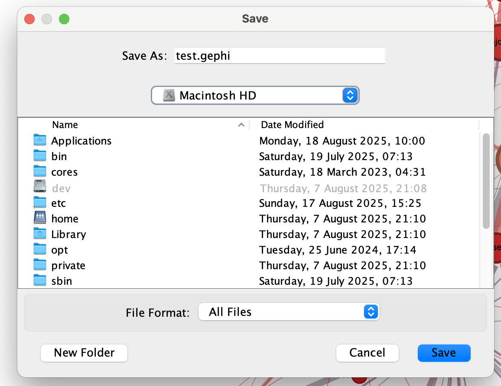

If you want to export your graph to be used in other software, you need to export it.

> In the top menu, click on “File” and then ”Export” and “Graph file…” to save your network in .gexf, .graphml or other formats.

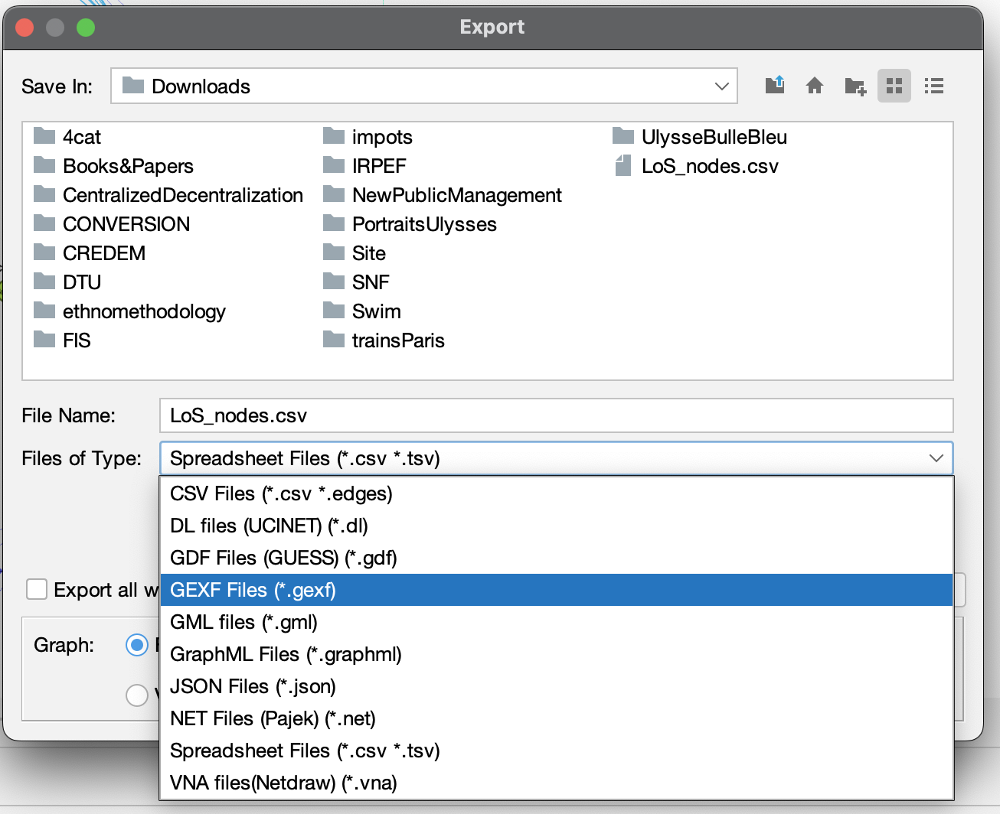

</section>

<section>

## To go further

This quick tour of the application is only a very partial overview of Gephi's features. Members of the community have developed more comprehensive tutorials that we recommend:

- [Martin Grandjean](http://www.martingrandjean.ch/gephi-introduction/)
- [Verónica Espinoza](https://medium.com/@vespinozag)
- [Clément Levallois](https://seinecle.github.io/gephi-tutorials/)
- [Mathieu Jacomy](https://jacomyma.github.io/mapping-controversies/#visualizing-networks-gephi)

Here is also a list of tutorials and other useful resources related to Gephi: [List](link)

</section>
